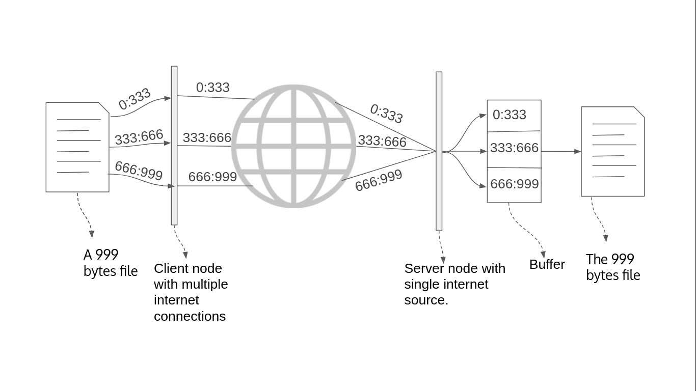

# bandwidth-aggregation
Software to aggregate multiple internet connection for a file transfer
 
#The Idea

 
The moto is to <b>DIVDE..SEND..MERGE</b> 
The above image represents the upload process. The client has a 999 bytes file and connected to 3 different ISPs. The client splits the file data into three segments and sends the segments via different ISP simultaneously. The server receives the data in buffer and rearranges it to retrieve the file.  
The segment size depends on the speed of the particular connection. Download follows similar.
 
Note : Code documentation and class diagram will be updated soon!
 
Made for network branch
